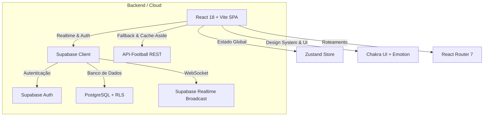

<div align="center">

  

  <p align="center">
    <strong>A plataforma definitiva para organização, sorteio e gestão multiplayer de torneios de EA Sports FC e futebol.</strong>
  </p>

  <p align="center">
    
    
    
    
    
    
  </p>

</div>

---

## Sobre o BiraSoccer

O **BiraSoccer** nasceu para transformar a tradicional "resenha" de videogame em uma experiência profissional de e-Sports. Ele substitui planilhas manuais e anotações improvisadas por um ecossistema completo em tempo real, onde os jogadores participam ativamente desde a fase de **Pick & Ban** dos times até a consagração no **Pódio dos Campeões**.

Desenvolvido com foco obsessivo em **UI/UX Mobile-First**, acessibilidade **WCAG AA** e arquitetura reativa moderna com **Supabase Realtime**.

---

## Funcionalidades em Destaque

### 1. Sala de Draft & Pick/Ban Multiplayer em Tempo Real
- **Escolha e Banimento Simultâneo:** Cada jogador conectado escolhe e bane seu clube diretamente pelo próprio smartphone/PC.
- **Exclusão Mútua Automática:** Clubes banidos ou já escolhidos ficam indisponíveis para os demais participantes da rodada.
- **Sorteio ou Reordenação Manual:** O Host pode embaralhar as posições ou **arrastar os cards (Drag & Drop)** para personalizar a fila de escolha.
- **Host Override para Convidados:** O anfitrião pode selecionar no lugar de amigos convidados ou ausentes sem travar o fluxo da sala.
- **Arquitetura Broadcast (RLS-Safe):** Comunicação *Peer-to-Host* via canais de Realtime Broadcast do Supabase, contornando travas de Row Level Security sem comprometer a segurança.

### 2. Formatos Competitivos Completos
- **Pontos Corridos (Liga Clássica):** Turno único ou Ida e Volta, com classificação atualizada automaticamente (Pontos &rarr; Saldo de Gols &rarr; Gols Pró &rarr; Confronto Direto).
- **Mata-Mata (Eliminação Simples):** Chaveamento com cruzamentos automáticos, suporte a agregados e mecanismo de **Lucky Loser** (balanceamento dinâmico de chaves ímpares).
- **Double Elimination (Repescagem):** Chave Superior (Upper Bracket), Chave Inferior (Lower Bracket), Grand Final e **Bracket Reset nativo**.
- **Liga + Playoffs (Híbrido):** Fase de grupos em pontos corridos que classifica automaticamente o Top 4 para as semifinais e finais.

### 3. Hub do Jogador & Sistema de Co-Administradores
- **Dashboard Pessoal:** Abas exclusivas para *"Meus Torneios"* e *"Torneios que Participo"*, exibindo time comandado e status em tempo real.
- **Co-Admins:** O anfitrião pode nomear administradores assistentes com permissão de lançar placares e avançar fases de jogo.
- **Perfil do Jogador:** Estatísticas globais (vitórias, gols, torneios disputados), medalhas acumuladas, Steam ID e upload de avatar com recorte circular (*crop*).

### 4. Grupos de Amigos & Histórico com Pódio
- **Mural do Grupo:** Criação de grupos com links de convite únicos para reunir a panela.
- **Histórico Oficial:** Registro permanente de todas as copas disputadas pelo grupo.
- **Pódio Visual:** Destaque automático dos 3 primeiros colocados (Campeão 🥇, Vice 🥈 e 3º Lugar 🥉).

### 5. Times Customizados & Cache-Aside Inteligente
- **Criação de Clubes:** Criação de times personalizados com upload de escudos locais.
- **Cache-Aside da API-Football:** Consultas à base de dados mundial com cache local no Supabase, economizando requisições e garantindo alta performance de busca.

### 6. Design System & Responsividade Mobile
- **Menu Hambúrguer (Drawer):** Navegação lateral ergonômica e fluida para smartphones.
- **Tabelas Adaptativas em Cards Verticais:** As tabelas de pontos se convertem automaticamente em cards empilhados no mobile, eliminando rolagens laterais desconfortáveis.
- **Dark & Light Mode:** Suporte nativo a temas com paleta de contraste premium (`#F94A29` Brand Orange, `#FDBB00` Mustard).
- **Ícones Padronizados:** 100% livre de emojis no sistema, utilizando tipografia e ícones vetoriais do `react-icons`.

---

## Arquitetura e Tecnologias



| Camada | Tecnologia | Propósito |
| :--- | :--- | :--- |
| **Core** | React 18 & TypeScript | Tipagem estrita e reatividade |
| **Build Tool** | Vite 4 | Hot Module Replacement (HMR) ultrarrápido |
| **UI Library** | Chakra UI 2 | Componentização flexível e acessível |
| **State Management** | Zustand 5 | Gerenciamento de estado global com persistência |
| **Database & Auth** | Supabase (PostgreSQL) | Armazenamento de dados, RLS e autenticação |
| **Realtime** | Supabase Broadcast Channels | Sincronização peer-to-peer de Draft sem conflito de RLS |
| **Image Cropping** | react-easy-crop | Enquadramento e compressão de avatares em Base64 |
| **Bracket Rendering** | @g-loot/react-tournament-brackets | Visualização de chaves de mata-mata |
| **Icons** | React Icons (Feather / Ionicons) | Iconografia vetorial limpa |

---

## Estrutura do Projeto

```text
EAFC26-CUP/
├── public/                     # Assets públicos e favicons
├── src/
│   ├── assets/                 # Logotipos e identidades visuais
│   ├── components/             # Componentes reutilizáveis
│   │   ├── Chaveamento.tsx            # Árvore de chaves e visualização de mata-mata
│   │   ├── DraftLobby.tsx             # Sala de Pick & Ban multiplayer em tempo real
│   │   ├── ModalEditarPerfil.tsx      # Modal de edição de perfil com crop de foto
│   │   ├── ModalConfiguracoesTorneio.tsx # Gestão de Co-Admins e vínculos
│   │   ├── Navbar.tsx                 # Header com Menu Hambúrguer (Drawer mobile)
│   │   ├── TabelaClassificacao.tsx    # Tabela com modo responsivo em cards
│   │   └── ...
│   ├── pages/                  # Telas e rotas da aplicação
│   │   ├── Dashboard.tsx              # Hub do Jogador e painel de torneios
│   │   ├── ConfigurarTorneio.tsx      # Wizard de criação de campeonatos
│   │   ├── TorneioLiga.tsx            # Painel de Pontos Corridos e Playoffs
│   │   ├── TorneioMataMata.tsx        # Painel de Eliminação Simples e Dupla
│   │   ├── DetalhesGrupo.tsx          # Gestão de membros e histórico com pódio
│   │   ├── MeusGrupos.tsx             # Listagem e criação de grupos
│   │   ├── MeusTimes.tsx              # CRUD de times customizados
│   │   ├── PerfilJogador.tsx          # Estatísticas individuais e conquistas
│   │   └── ...
│   ├── services/               # Camada de comunicação de rede
│   │   ├── apiFutebol.ts              # Cache-Aside integrado à API-Football
│   │   ├── gruposService.ts           # Operações de grupos e convites
│   │   ├── perfisService.ts           # Gestão de perfis no Supabase
│   │   └── timesCustomizadosService.ts # Gestão de clubes locais
│   ├── store/                  # Store global do Zustand
│   │   └── torneioStore.ts            # Lógica central de torneios, sorteios e regras
│   ├── types/                  # Definições de tipos TypeScript
│   │   ├── torneio.ts                 # Interfaces de torneios, partidas e podio
│   │   └── social.ts                  # Interfaces de grupos, perfis e membros
│   ├── theme.ts                # Design Tokens e tema Chakra UI
│   ├── App.tsx                 # Roteamento central e Protected Routes
│   └── main.tsx                # Bootstrap da aplicação
├── supabase_schema.sql         # Schema SQL completo e políticas RLS
├── .env.example                # Template das variáveis de ambiente
└── package.json
```

---

## Como Executar Localmente

### Pré-requisitos
- **Node.js** (v18 ou superior)
- **npm** ou **yarn**
- Conta e projeto criado no [Supabase](https://supabase.com)

### 1. Clonar o Repositório
```bash
git clone https://github.com/SEU_USUARIO/EAFC26-CUP.git
cd EAFC26-CUP
```

### 2. Instalar as Dependências
```bash
npm install
```

### 3. Configurar as Variáveis de Ambiente
Crie um arquivo `.env.local` na raiz do projeto baseado no `.env.example`:

```bash
cp .env.example .env.local
```

Preencha as variáveis no arquivo `.env.local`:
```env
VITE_SUPABASE_URL=https://SEU_PROJETO.supabase.co
VITE_SUPABASE_ANON_KEY=SUA_CHAVE_PUBLICA_ANON
VITE_FOOTBALL_API_KEY=SUA_CHAVE_API_FOOTBALL_OPCIONAL
```

### 4. Configurar o Banco de Dados (Supabase)
1. Acesse o painel do seu projeto no Supabase &rarr; **SQL Editor**.
2. Cole e execute todo o conteúdo do arquivo [`supabase_schema.sql`](./supabase_schema.sql).
3. Habilite o recurso de **Realtime** para a tabela `torneios_publicos` em *Database &rarr; Replication*.

### 5. Iniciar o Servidor de Desenvolvimento
```bash
npm run dev
```

Abra no navegador em: `http://localhost:5173`

---

## Scripts Disponíveis

| Comando | Descrição |
| :--- | :--- |
| `npm run dev` | Inicia o servidor Vite em modo de desenvolvimento com HMR |
| `npm run build` | Compila o bundle TypeScript e minifica os assets para produção |
| `npm run preview` | Executa um servidor local para testar o build gerado em `/dist` |
| `npm run lint` | Executa o linter ESLint para validação de padrões de código |

---

## Licença

Este projeto é desenvolvido para fins competitivos, educacionais e portfólio. Distribuído sob a licença **MIT**.

---

<div align="center">
  
  <p><strong>BiraSoccer</strong> — Feito para quem respira futebol e videogame.</p>
</div>
